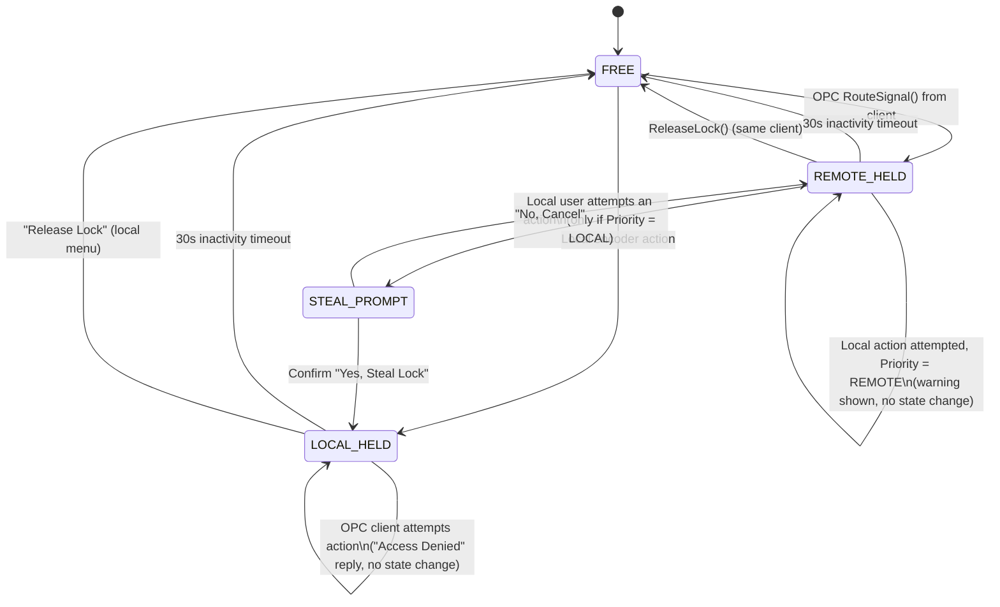

# SignalSpliter

A 2×16 signal routing controller (2 inputs, 16 outputs) built on a Raspberry Pi Zero W (v1), with a physical rotary encoder, an IPS LCD display, and remote control via OPC UA.
Based on the project https://github.com/Luk9091/SignalSpliter by Łukasz Przystupa

## Table of Contents

- [Device Overview](#device-overview)
- [Hardware Requirements](#hardware-requirements)
- [Wiring Diagram](#wiring-diagram)
- [1. Operating System Installation](#1-operating-system-installation)
- [2. Hardware Interface Configuration](#2-hardware-interface-configuration)
- [3. Project Installation](#3-project-installation)
  - [3.1 Manual Test Run](#31-manual-test-run)
- [4. 24/7 Stability Configuration](#4-247-stability-configuration)
- [5. Running as a systemd Service](#5-running-as-a-systemd-service)
- [6. Verification and Diagnostics](#6-verification-and-diagnostics)
- [Usage](#usage)
  - [Status Bar](#status-bar)
  - [Main Screens](#main-screens)
  - [Settings Options](#settings-options)
  - [Screensaver](#screensaver)
  - [Access Control (Lock) State Machine](#access-control-lock-state-machine)
  - [Offline / Online Clock Behaviour](#offline--online-clock-behaviour)
- [Known Issues and Their Resolutions](#known-issues-and-their-resolutions)
- [Project Structure](#project-structure)

---

## Device Overview

SignalSpliter routes 2 input signals (IN1, IN2) to any of 16 outputs, with mutual exclusion - a single output can only be assigned to one input at a time. Control is available through two paths:

- **Physically** - via a single rotary encoder with a push button, navigating a menu on the LCD.
- **Remotely** - via an **OPC UA** server (port 4840), with access arbitration between local and remote control (a lock mechanism with priority and an inactivity timeout).

The device includes a screensaver, full event logging, and a hardware watchdog that automatically restarts the system if it becomes unresponsive.

## Hardware Requirements

| Component | Model used in this project |
|---|---|
| Board | Raspberry Pi Zero W (v1, ARMv6) |
| Display | 1.47" IPS LCD, 172×320px, JD9853 controller, SPI |
| Encoder | SparkFun Qwiic Twist (I2C) |
| Output expander / relays | Module driven by `Expander/relay_board.py` (MCP23017 I2C GPIO expander) |
| SD card | microSD, 8GB minimum, Class 10 |

## Wiring Diagram

> **Note:** the display is connected to the **SPI1** (auxiliary) bus, not the default SPI0. The reason is explained in [Known Issues](#known-issues-and-their-resolutions) - this is a deliberate design decision forced by a `spi_bcm2835` driver bug, not an oversight.

| Signal | GPIO (BCM) | Physical pin | Connected to |
|---|---|---|---|
| SCLK | GPIO21 | 40 | LCD SCLK (SPI1) |
| MOSI / DIN | GPIO20 | 38 | LCD DIN (SPI1) |
| CS | GPIO18 | 12 | LCD CS (SPI1, `spi1-1cs`) |
| RST | GPIO27 | 13 | LCD RST |
| DC | GPIO25 | 22 | LCD DC |
| Backlight (BL, PWM) | GPIO12 | 32 | LCD BL |
| I2C SDA | GPIO2 | 3 | Qwiic Twist encoder / expander |
| I2C SCL | GPIO3 | 5 | Qwiic Twist encoder / expander |

---

## 1. Operating System Installation

The Raspberry Pi Zero W (v1) has an **ARMv6** processor, which does not support 64-bit instructions - a **32-bit** OS is required.

1. Download and install the [Raspberry Pi Imager](https://www.raspberrypi.com/software/).
2. Select the image: **Raspberry Pi OS Lite (32-bit)**
3. 
   - Set the hostname, username, and password.
   - Configure Wi-Fi (if remote control via OPC UA is meant to work over the network).
   - Enable SSH.
4. Flash the image to the SD card, insert it into the Pi, and boot.
5. Log in over SSH:
   ```bash
   ssh <user>@<ip_address>
   ```
6. Update the system **before** proceeding with further configuration:
   ```bash
   sudo apt update && sudo apt full-upgrade -y
   sudo rpi-eeprom-update -a
   sudo reboot
   ```

## 2. Hardware Interface Configuration

All hardware configuration (SPI, I2C, watchdog, and disabling unused peripherals) lives in a single `config.txt` file included in this repository.

1. Copy the provided configuration file onto the Pi:
   ```bash
   sudo cp config.txt /boot/firmware/config.txt
   ```
   (if you'd rather merge it into an existing config instead of overwriting the whole file, review [`config.txt`](./config.txt) in this repo and copy over the relevant lines)

2. This file configures, among other things:
   - `dtparam=i2c_arm=on`, `dtparam=spi=on` - enables I2C and SPI0.
   - `dtoverlay=spi1-1cs` - enables the auxiliary SPI1 bus, which the display uses.
   - `dtoverlay=disable-bt`, `dtparam=audio=off`, `camera_auto_detect=0`, `display_auto_detect=0` - disables unused peripherals, reducing the number of active drivers/interrupt sources on the single-core CPU.
   - `[Manager] RuntimeWatchdogSec=15` - hardware watchdog configuration.

3. Reboot:
   ```bash
   sudo reboot
   ```

4. Verify that the buses are visible:
   ```bash
   ls /dev/spidev1.*      # display - expected: /dev/spidev1.0
   ls /dev/i2c-1            # encoder / expander
   i2cdetect -y 1            # should show the encoder's address on the bus
   ```

## 3. Project Installation

```bash
sudo apt install -y git python3-venv python3-pip i2c-tools

git clone https://github.com/Sket00/SignalSpliter.git ~/SignalSpliter
cd ~/SignalSpliter

python3 -m venv env
source env/bin/activate

pip install --upgrade pip
pip install -r requirements.txt
```

> **Note on `qwiic_twist`:** depending on PyPI package availability, you may need to install `pip install sparkfun-qwiic` (SparkFun's bundled package) instead of a standalone library - check `pip index versions qwiic-twist` if the standard install fails.

Verify everything imports cleanly:
```bash
python3 -c "import spidev, numpy, PIL, gpiozero, asyncua, sdnotify; print('OK')"
```

### 3.1 Manual Test Run

Before wiring this up as a systemd service, run it manually once to confirm the display, encoder, and relays all initialise correctly:

```bash
source env/bin/activate     # if not already active from the steps above
python3 main.py
```

## 4. 24/7 Stability Configuration

### 4.1 Persistent Kernel Logging

Raspberry Pi OS defaults to **RAM-only** logs via a built-in `/usr/lib/systemd/journald.conf.d/40-rpi-volatile-storage.conf` file. To override this, you need your **own** file with the same name under `/etc/`:

```bash
sudo mkdir -p /etc/systemd/journald.conf.d
sudo cp 40-rpi-volatile-storage.conf /etc/systemd/journald.conf.d/40-rpi-volatile-storage.conf
sudo systemctl restart systemd-journald
sudo journalctl --flush
```

Verify:
```bash
ls /var/log/journal/     # a directory with a machine-id should appear
journalctl --disk-usage
```

### 4.2 Hardware Watchdog

`RuntimeWatchdogSec=15` in `config.txt` (see step 2) enables the BCM hardware watchdog - if the process stops responding (not just in Python, but e.g. a hung kernel/driver), the Pi performs a **hard reset** after roughly 15-30s without a heartbeat.

Verify after rebooting:
```bash
sudo systemctl show -p RuntimeWatchdogUSec
# expected: RuntimeWatchdogUSec=15s
```

### 4.3 SPI Bus and Driver Configuration

The display driver (`Display/jd9853.py`) is already configured for SPI1 in this repository - **no code changes are needed**, as long as the physical wiring and `config.txt` match what's described above. See the section below for the full context behind these specific values.

## 5. Running as a systemd Service

A ready-to-use systemd unit file is included in this repo as [`signalspliter.service`](./signalspliter.service).

```bash
sudo cp signalspliter.service /etc/systemd/system/signalspliter.service
sudo nano /etc/systemd/system/signalspliter.service   # fix User=/ExecStart=/WorkingDirectory= if your install path differs from /home/admin/SignalSpliter

sudo systemctl daemon-reload
sudo systemctl enable --now signalspliter.service
```

Check the status:
```bash
sudo systemctl status signalspliter.service
```
It should show `active (running)`.

## 6. Verification and Diagnostics

**Live application logs:**
```bash
journalctl -u signalspliter.service -f
```

Log lines are tagged for easy filtering: `[ROUTE]` for every routing change (with its source - `LOCAL` or a client id), `[LOCK]` for access-control events, and `[RUNTIME]` for hourly cumulative uptime snapshots. For example:
```bash
journalctl -u signalspliter.service | grep '\[ROUTE\]'
```
Total device runtime is also available without touching the logs - as `Total_Runtime_Hours` over OPC UA, and as a read-only line on the device's Settings screen.

---

## Usage

### Status Bar

Shown at the top of every screen (except the screensaver):

```
● LOCAL          192.168.1.50          42.5°C
```

- **Left** — a coloured dot + text showing the current lock owner: `FREE` (grey), `LOCAL` (green), or a remote client identifier (blue).
- **Center** — the device's current IP address, or `OFFLINE` if none is assigned. This is the address to use when connecting an OPC UA client (`opc.tcp://<IP>:4840/freeopcua/server/`). Cached for 15s, does not require internet access — any LAN address is sufficient.
- **Right** — CPU temperature, refreshed every 2s.

### Main Screens

| Screen | Purpose |
|---|---|
| **Menu** | Two large tiles showing IN1/IN2 current output, plus a bottom dock to enter Routing or Settings. |
| **Routing** | Tabs for IN1 / IN2; selecting one opens the 16-output grid. |
| **Routing Grid** | Pick an output (1-16) for the active input. The output already used by the *other* input is shown greyed out (mutual exclusion). |
| **Settings** | See below. |
| **Color Select** | Pick a highlight colour for IN1 or IN2 from a fixed palette. |

### Settings Options

| Item | Effect | Requires lock? |
|---|---|---|
| Release Lock | Releases the lock if held locally | No |
| Priority: LOCAL/REMOTE | Toggles whether the local encoder is allowed to steal the lock from a remote OPC client (see state diagram below) | No |
| IN1 / IN2 Color | Opens the colour picker for that input's highlight colour | Yes |
| Switch to Dark/Light | Toggles the UI theme | No |
| Set Time | Opens the manual clock editor (hour, then minute; click to confirm each field) - only meaningful while offline, see [Offline / Online Clock Behaviour](#offline--online-clock-behaviour) | No |
| *Uptime: NNNh* (read-only) | Total device runtime, persisted across restarts | — |

### Screensaver

Activates after 45s of inactivity. Two variants exist in this repo (`gui_matrix.py` = bouncing icons, `gui_matrix_showcase.py` = the variant currently in use): three logos shown at once in fixed slots, cycling their arrangement every 4s via a smooth diagonal tile-wipe transition. Rotating the encoder or pressing the button exits the screensaver and returns to the previous screen.

### Access Control (Lock) State Machine

Both the physical encoder and OPC UA clients must hold the lock before changing routing. Only one owner at a time; a 30s inactivity timeout releases it automatically.



**Key asymmetry:** only the local encoder can ever steal the lock (and only when `Priority = LOCAL`) — a remote OPC client can never steal; it always receives `Access Denied` if the lock is held by someone else. The `priority` flag is only ever consulted client-side in the GUI (`gui_matrix*.py`), never inside `opc_server.py`.

### Offline / Online Clock Behaviour

The Raspberry Pi Zero W has no battery-backed RTC, so without network access there is no reliable source of the current time.

- **Online** (`Utils/network_info.get_ip()` returns an address): log timestamps use the OS clock directly, assumed to be NTP-synced automatically by Raspberry Pi OS.
- **Offline, never set**: log lines show `--:--` instead of a fabricated/misleading time.
- **Offline, manually set**: use Settings → "Set Time" once; the value is kept in memory as an offset from `time.monotonic()` for the rest of the session. It does **not** persist across restarts (no RTC to anchor it to) - this is an accepted trade-off, not an oversight.
- If the device comes back online later in the same session, timestamps automatically switch back to the OS clock - no restart needed.

**Known limitation:** this only affects the timestamp printed *inside* each log line (`[%(asctime)s] ...`). The **rotated log filenames** (`signal_spliter.log.YYYY-MM-DD`) are generated by Python's `TimedRotatingFileHandler`, which reads the raw OS clock directly and is not aware of `device_clock` - if the device boots offline with an unset/incorrect system date, a rotated file's *name* may not match the honest `--:--` timestamps found inside it. This was a deliberate scope decision (fixing it would require reimplementing log rotation) rather than an oversight.

---

## Known Issues and Their Resolutions

### Kernel oops when running on the default SPI0 bus

**Symptom:** after several to a dozen or so hours of continuous operation, the system would hard-freeze and restart (via the watchdog), with no exception in the application logs. Analysis of `journalctl -k` revealed a kernel oops:

```
Unable to handle kernel execution of memory at virtual address ... when execute
Internal error: Oops: 8000000f [#1] ARM
Comm: python3 ... Tainted: G D C  6.18.34+rpt-rpi-v6
LR is at arch_sync_dma_for_device+0x50/0x64
```

**Cause:** instability in the DMA path of the `spi_bcm2835` driver (SPI0 bus) on this kernel version, triggered by SPI transfers to the display. Attempts that were tested and found **ineffective**: lowering the SPI clock, a kernel update, manually chunking transfers into smaller blocks, and forcing PIO mode via `polling_limit_us`.

**Resolution:** moving the display to the **SPI1** (auxiliary) bus, driven by a separate kernel driver (`spi_bcm2835aux`) unaffected by this bug. Since this change, the device has run for many hours at a stretch without a single kernel oops. This is already the default configuration in this repository (`dtoverlay=spi1-1cs` in `config.txt`, `spidev.SpiDev(1, 0)` in `Display/jd9853.py`, wiring per the table in [Wiring Diagram](#wiring-diagram)) - **there is no need to re-diagnose this** unless the physical wiring is changed back to SPI0.

### Default logs disappear after a reboot

Raspberry Pi OS forces `Storage=volatile` via its own file under `/usr/lib/systemd/journald.conf.d/`, which takes precedence over the standard `/etc/systemd/journald.conf`. The fix is described in step [4.1](#41-persistent-kernel-logging) - a file with the same name under `/etc/` overrides the default.

---


## Project Structure

```
SignalSpliter/
├── main.py                  # main entry point, application loop + watchdog
├── Config/
│   └── settings.py           # configuration (screen dimensions, orientation, paths)
├── Display/
│   ├── screen_manager.py     # display management, partial updates, reconnect logic
│   └── jd9853.py             # SPI driver for the LCD controller (SPI1)
├── Encoder/
│   └── twist_driver.py       # Qwiic Twist encoder handling (I2C)
├── Expander/
│   └── relay_board.py        # relay/output switching logic
├── Interface/
│   └── gui_matrix.py         # UI (screen state machine, Pillow rendering)
├── Network/
│   └── opc_server.py         # OPC UA server, arbitration via LockManager
├── Utils/
│   ├── lock_manager.py       # local/remote access lock (thread-safe)
│   ├── logger.py             # logging configuration (tagged [ROUTE]/[LOCK]/[RUNTIME], daily rotation)
│   ├── runtime_tracker.py    # persistent, crash-safe total-runtime counter
│   ├── device_clock.py       # best-effort clock for log timestamps (OS clock online, manual offline)
│   └── network_info.py       # cached IP lookup, shared by the clock, logger and GUI
├── Assets/                   # icons, fonts
├── config.txt                # target /boot/firmware/config.txt
├── signalspliter.service     # systemd unit
├── 40-rpi-volatile-storage.conf  # journald drop-in
└── requirements.txt
```
